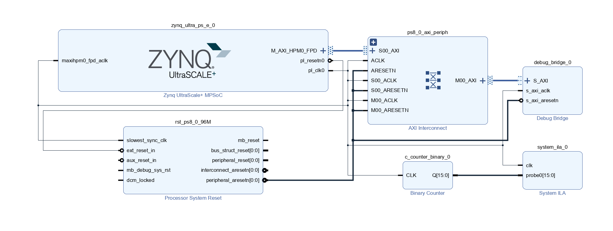
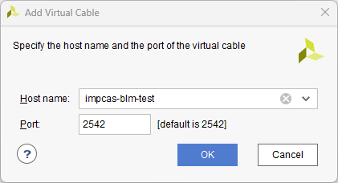
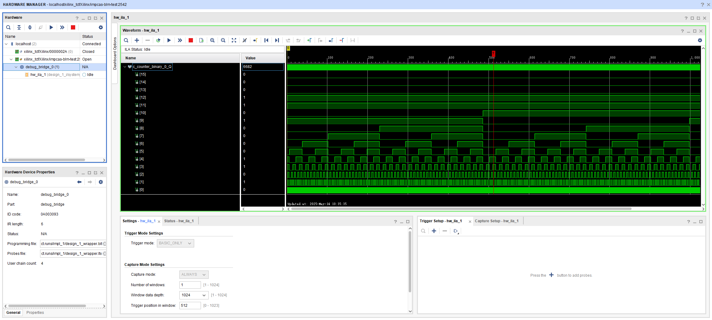

## xvc bd design


## petalinux
### refs
- https://github.com/Xilinx/XilinxVirtualCable
- https://xilinx-wiki.atlassian.net/wiki/spaces/A/pages/644579329/Xilinx+Virtual+Cable

### petalinux-config
- `initrd` or `initramfs` (error: there's no '/dev' on rootfs)
  - set `petalinux-config -> Image packaging configuration -> ( petalinux-image-minimal ) INITRAMFS/INITRD`
- custom rootfs on mmc :ok:
  - https://rcn-ee.com/rootfs/eewiki/minfs/debian-13-base-arm64-2025-05-09.tar.xz
- static IP address, e.g. `192.168.137.50`

### add xvc driver from github repo
- add kernel module
  ```bash
  petalinux-create -t modules -n xvc-driver --enable
  ```
- edit bb file: `<plnx-proj-root>/project-spec/meta-user/recipes-modules/xvc-driver/xvs-driver.bb`
  ```bb
  SUMMARY = "Recipe for  build an external xvc-driver Linux kernel module"
  SECTION = "PETALINUX/modules"
  LICENSE = "GPLv2"
  LIC_FILES_CHKSUM = "file://COPYING;md5=b234ee4d69f5fce4486a80fdaf4a4263"


  inherit module

  INHIBIT_PACKAGE_STRIP = "1"

  SRC_URI = "file://Makefile \
            file://COPYING \
            file://xvc_driver_base.c \
            file://xvc_driver.c \
            file://xvc_driver.h \
            file://xvc_ioctl.h \
            file://xvc_user_config.h \
            "

  S = "${WORKDIR}"

  MODULES_DIR="${TOPDIR}/../images/linux/modules"

  do_install_append() {
      mkdir -p ${MODULES_DIR}
      cp ${B}/xilinx_xvc_driver.ko ${MODULES_DIR}
  }
  ```
- edit makefile (not needed on petalinux 2021.1)
  ```makefile
  obj-m := xvc-driver.o
  xvc-driver-objs := xvc_driver.o xvc_driver_base.o
  ```
- alter `xvc_driver.h`
  ```c
  #define LOG_PREFIX " XVC "
  ```
- alter `xvc_driver_base.c` (not needed on petalinux 2021.1)
  ```c
  #include <linux/version.h>

  #if KERNEL_VERSION(5, 4, 0) >= LINUX_VERSION_CODE
          mmiowb();
  #endif
  ```
### add xvc app
- create app
  ```bash
  petalinux-create -t apps -n xvc-server --enable
  ```
- edit `xvcServer.c` (not needed on petalinux 2021.1)
  ```c
  #define USE_IOCTL
  ```
- alter bb file: `<plnx-proj-root>/project-spec/meta-user/recipes-apps/xvcServer/xvcServer.bb`
  ```bb
  SUMMARY = "Simple xvc-server application"
  SECTION = "PETALINUX/apps"
  LICENSE = "MIT"
  LIC_FILES_CHKSUM = "file://${COMMON_LICENSE_DIR}/MIT;md5=0835ade698e0bcf8506ecda2f7b4f302"

  SRC_URI = "file://xvcServer.c \
            file://xvc_ioctl.h \
            file://Makefile \
            "

  DEPENDS = "\
      xvc-driver \
      "

  S = "${WORKDIR}"

  do_compile() {
        oe_runmake
  }

  do_install() {
        install -d ${D}${bindir}
        install -m 0755 xvc-server ${D}${bindir}
  }

  do_install_append() {
      install -d ${TOPDIR}/../images/linux/apps/
      install -m 0755 ${D}${bindir}/xvc-server ${TOPDIR}/../images/linux/apps/
  }
  ```

### alter device tree: `<plnx-proj-root>/project-spec/meta-user/recipes-bsp/device-tree/files`
- xvc
  ```devicetree
  / {
    chosen {
            bootargs = "earlycon console=ttyPS0,115200 clk_ignore_unused root=/dev/ram0 rw cpuidle.off=1";
            stdout-path = "serial0:115200n8";
    };
  };

  &debug_bridge_0 {
          compatible = "xlnx,xvc";
  };
  ```
- board vendor related (may not working for you)
  ```devicetree
  &sdhci1 {
      no-1-8-v; // 1.8V to 3.3V level shifter (i.e. using LVCMOS18, but sd connector is driven by 3.3V)
      disable-wp;
      disable-cd;
  };

  &gem3 {
      phy-handle = <&phyc>;
      phyc: phy@c {
          reg = <0xc>;
          ti,rx-internal-delay = <0x8>;
          ti,tx-internal-delay = <0xa>;
          ti,fifo-depth = <0x1>;
          ti,dp83867-rxctrl-strap-quirk;
      };
  };
  ```

### build
  ```bash
  petalinux-build -c xvc-driver
  petalinux-build -c xvc-server
  ```

  ```bash
  petalinux-build
  petalinux-package --boot --fsbl --u-boot --fpga --force
  ```

### run
- xvc kernel module
  ```bash
  modprobe xvc-driver
  insmod xilinx-xvc-driver # custom rootfs
  ```
- xvc server
  ```bash
  xvc-server
  ```
- log
  ```log
  root@impcas-blm-test:~# insmod /boot/xvc/xilinx_xvc_driver.ko
  [  282.311725] xilinx_xvc_driver: loading out-of-tree module taints kernel.
  [  282.318926]  XVC Starting...
  [  282.322134]  XVC Created device xilinx_xvc_driver
  root@impcas-blm-test:~# /boot/xvc/xvc-server
  INFO: XVC driver character file: /dev/xilinx_xvc_driver
  INFO: debug_bridge base address: 0xA0000000
  INFO: debug_bridge size: 0x10000
  INFO: debug_bridge device tree compatibility string: xlnx,xvc

  INFO: To connect to this xvcServer instance, use url: TCP:impcas-blm-test:2542

  connection accepted - fd 5
  setting TCP_NODELAY to 1
  ```
- screenshot

  <details>

    

    

  </details>
